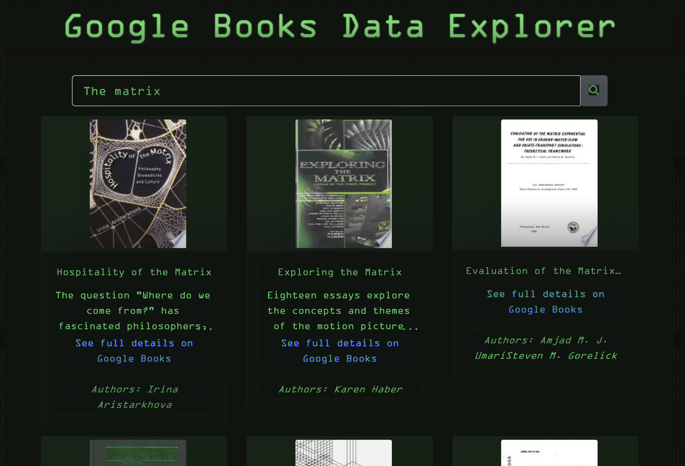

# Google Books Data Explorer
[](/LICENSE)

Try it on Heroku →  <https://search-google-books-mern.herokuapp.com/>




## Table of Contents

- [Overview](#overview)
- [Getting Started](#getting_started)
- [Usage](#usage)
- [Installation](#installation)
- [Deployment](#deployment)
- [Built Using](#tech_stack)
- [Contributing](#contributing)

---
##  Overview <a name = "overview"></a>

Overview description. 

----
##  Getting Started <a name = "getting_started"></a>


Install Git and Node.js to develop. 

```
git clone https://github.com/alane019/google-books-mern.git
```
This will copy all files from this github repository to your working directory.

----
## Installation  <a name = "installation"></a>

 Install all node package dependencies listed in the package.json file using the following command in your terminal, in the directory of the project:

```
npm install
```
You can also use:

```
npm i
```


----

##  Usage <a name = "usage"></a>


Search for books and add books. 

----
##  Deployment <a name = "deployment"></a>
[Create React App](https://create-react-app.dev/docs/getting-started) was used to stand up this demo. You can follow the steps provided in the [official documentation](https://create-react-app.dev/docs/getting-started) throughout the development process to test and deploy.

 To launch a test version of the application, use the following in your development terminal: 

 `npm start`  or  `yarn start`.

 To prepare a production bundle for deployment, use `npm run build` or `yarn build`.

----

##  Technologies Used  <a name = "tech_stack"></a>
- [NodeJs](https://nodejs.org/) -  JavaScript runtime. 
- [React](https://reactjs.org/) - JavaScript front-end library.
- [Axios](https://github.com/axios/axios) - Promise based HTTP client optimized for effificent development of secure and performant NodeJS web applications. 
- [Create React App](https://create-react-app.dev/docs/getting-started) is used to bootstrap the setup and configuration of build tools like [Babel](https://babeljs.io/) and [Webpack](https://webpack.js.org/), which are used for JavaScript module bundling and dynamic transpiling of project resources.


----
##  Contributing <a name = "contributing"></a>

 To suggest changes, or request enhancements, submit a pull request or an issue if you would like to contribute This project should be a great resource for anyone looking for a working introduction to NodeJs React development with REST APIs. 

